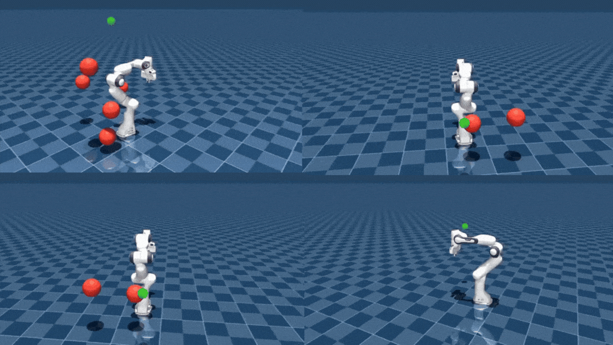

# Minimal-ManiFlow

### 1. Setup

```sh
cd minimal-maniflow
uv sync
```

### 2. Train

```sh
bash scripts/train.sh --zarr dataset/data.zarr --n_epochs 500 --batch 64 --checkpoint_path checkpoints/run_01
```

### 3. Closed-Loop Run


```sh
# `--enable_orbit` cli arg is optional
bash scripts/run.sh --ckpt checkpoints/model.pt --enable_orbit
```

### Collect Data

```sh
bash scripts/collect_data.sh --n_episodes 2000 --out dataset/data.zarr
```


## Output

Closed-loop inference with different obstacle density varying from obstacle-free to 5 obstacles.

